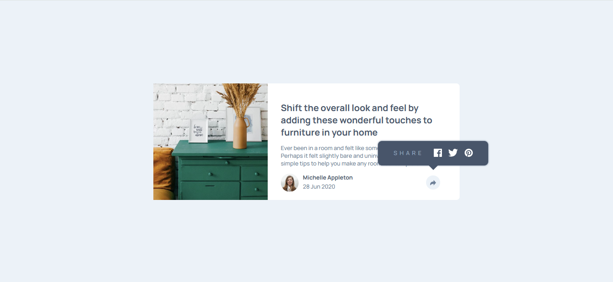

# Article Preview Component

This is a solution to the **Article Preview Component** challenge on Frontend Mentor.  
The goal of this challenge is to build a responsive article preview card with a share button that toggles social media links.

## 📸 Screenshot

_Add a screenshot of your solution here_

## 🔗 Links

- **Solution URL:** https://www.frontendmentor.io/solutions/article-preview-component-using-html-css-js
- **GitHub Repository:** https://github.com/prashantrajch/front-end-mentor/tree/main/article-preview-component-master
- **Live Site URL:**https://flourishing-creponne-9cc7da.netlify.app/

## 🛠 Built With

- Semantic **HTML5**
- **CSS Custom Properties**
- **Flexbox**
- **CSS Grid**
- **Mobile-first workflow**
- **Vanilla JavaScript**
- **Google Fonts (Manrope)**

## ✨ Features

- Responsive layout for mobile and desktop screens
- Interactive share button with smooth animation
- Tooltip-style share menu on desktop
- Bottom slide-up share section on mobile
- Clean and accessible HTML structure

## 📂 Project Structure

├── images
│ ├── avatar-michelle.jpg
│ ├── drawers.jpg
│ ├── icon-facebook.svg
│ ├── icon-twitter.svg
│ ├── icon-pinterest.svg
│ └── icon-share.svg
├── index.html
├── style.css
├── script.js
└── README.md

## 🧠 What I Learned

- How to toggle UI elements using JavaScript class manipulation
- Handling different tooltip behaviors for mobile and desktop
- Using `position: absolute` effectively inside responsive layouts
- Combining Flexbox and Grid for clean layouts

## 🚀 Continued Development

In future projects, I want to:
- Improve accessibility (ARIA roles for tooltips)
- Add keyboard interaction support
- Enhance animations using CSS transitions

## 👤 Author

- **Name:** Prashant Raj  
- **Frontend Mentor:** https://www.frontendmentor.io/profile/prashantrajch  
- **GitHub:** https://github.com/prashantrajch

## 🙌 Acknowledgments

Thanks to **Frontend Mentor** for providing amazing real-world frontend challenges.

