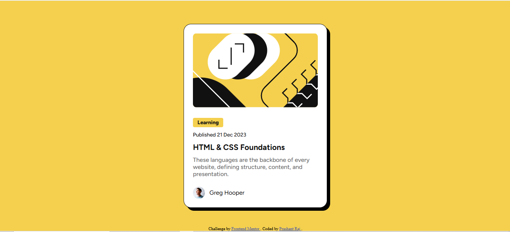

# Frontend Mentor - Blog preview card solution

This is a solution to the [Blog preview card challenge on Frontend Mentor](https://www.frontendmentor.io/challenges/blog-preview-card-ckPaj01IcS). Frontend Mentor challenges help you improve your coding skills by building realistic projects.

## Table of contents

- [Overview](#overview)
  - [The challenge](#the-challenge)
  - [Screenshot](#screenshot)
  - [Links](#links)
- [My process](#my-process)
  - [Built with](#built-with)
  - [What I learned](#what-i-learned)
  - [Continued development](#continued-development)
  - [Useful resources](#useful-resources)
- [Author](#author)
- [Acknowledgments](#acknowledgments)

## Overview

### The challenge

Users should be able to:

- See hover and focus states for all interactive elements on the page

### Screenshot



### Links

- Solution URL: [GitHub Repo](https://github.com/prashantrajch/blog-preview-card)
- Live Site URL: [Live Site on GitHub Pages](https://gregarious-cactus-b86013.netlify.app/)

## My process

### Built with

- Semantic HTML5 markup
- CSS custom properties
- Flexbox
- Mobile-first workflow
- Vanilla HTML & CSS
- Custom web fonts (Figtree)

### What I learned

This challenge helped me practice creating a fully responsive and visually polished card UI component using basic HTML and CSS. I focused on using custom fonts via `@font-face`, managing layout with Flexbox, and applying reusable design tokens via CSS variables.

Here's a code snippet showing how I implemented custom fonts:

```css
@font-face {
  font-family: "Figtree Variable";
  src: url("./assets/fonts/Figtree-VariableFont_wght.ttf") format("truetype");
  font-weight: 100 900;
  font-style: normal;
}
```
Continued development
In the future, I plan to:

Add hover interactions to the card title

Animate the card entrance using CSS transitions or keyframes

Explore converting this into a reusable component using a framework like React

Useful resources
MDN Web Docs – For reference on CSS variables and Flexbox

Frontend Mentor Slack Community – Helpful for peer feedback and learning

Author
Website – prashantrajch.github.io

Frontend Mentor – @prashantrajch

GitHub – @prashantrajch

Acknowledgments
Thanks to Frontend Mentor for providing high-quality front-end practice challenges!

vbnet
Copy
Edit

---

Let me know if:

- You want the **screenshot** added as an actual file (you can upload it here)
- You want to tweak the **technology stack** (e.g., remove React/Next.js from the template)
- You’d like a version with additional badges or license info

Once you're happy, you can save this as `README.md` and push it to your repo.