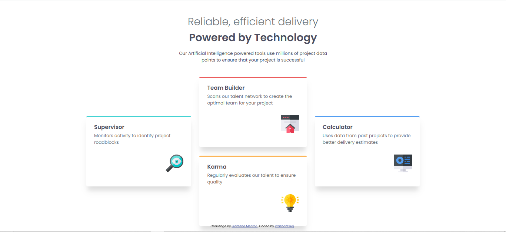

# Frontend Mentor - Four card feature section solution

This is a solution to the [Four card feature section challenge on Frontend Mentor](https://www.frontendmentor.io/challenges/four-card-feature-section-weK1eFYK). Frontend Mentor challenges help you improve your coding skills by building realistic projects.

---

## Table of contents

- [Overview](#overview)
  - [The challenge](#the-challenge)
  - [Screenshot](#screenshot)
  - [Links](#links)
- [My process](#my-process)
  - [Built with](#built-with)
  - [What I learned](#what-i-learned)
  - [Continued development](#continued-development)
  - [Useful resources](#useful-resources)
- [Author](#author)

---

## Overview

### The challenge

Users should be able to:

- View the optimal layout depending on their device's screen size
- See a clean and responsive card-based layout

### Screenshot



### Links

- Solution URL: https://www.frontendmentor.io/solutions/four-card-feature-section-using-html-and-css-flexbox
- Live Site URL: https://classy-paletas-23f7b1.netlify.app/

---

## My process

### Built with

- Semantic HTML5 markup
- CSS custom properties (CSS variables)
- Flexbox
- Mobile-first workflow
- Responsive typography using `clamp()`

### What I learned

In this project, I practiced building a **responsive layout using Flexbox** without using CSS Grid or JavaScript.

Key learnings:

- How to structure cards semantically using `<article>`
- How to use **CSS variables** to dynamically change border colors
- Creating a responsive layout by switching `flex-direction` in media queries
- Using `clamp()` for fluid font sizes

Example of dynamic border color using CSS variables:

```css
.card {
  border-top: 4px solid var(--border-clr);
}

And setting it directly in HTML:

<article class="card" style="--border-clr: var(--clr-primary-cyan)">
```


Continued development

In future projects, I want to:

Improve complex Flexbox layouts

Explore CSS Grid for similar card-based designs

Focus more on accessibility best practices

Write cleaner and more scalable CSS

Useful resources

MDN Flexbox Guide
 – Helped me understand Flexbox layout behavior

Frontend Mentor Community
 – Great inspiration and learning from other solutions

Author
Website - Prashant Raj

Frontend Mentor - @prashantrajch

GitHub - @prashantrajch

Acknowledgments
Thanks to Frontend Mentor for providing these challenges to help developers improve their frontend skills with real-world designs.

---

### ✅ Next Steps

- Replace the `screenshot.jpg` file with your actual screenshot.
- Update the `Solution URL` and `Live Site URL`.
- If you didn’t use React, Next.js, or Styled Components (as in the original template), I removed them from the list — your project is purely HTML + CSS.

Would you like me to also help you:
- Deploy this on GitHub Pages or Vercel?
- Add the screenshot for you if you upload it?

Let me know!