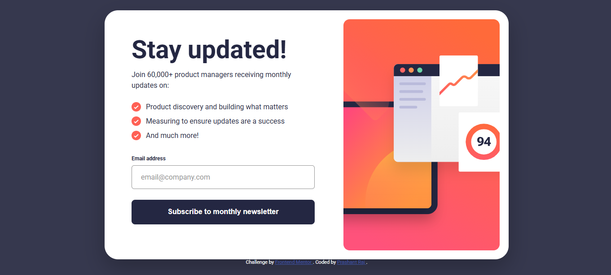

# Frontend Mentor – Newsletter sign-up form with success message solution

This is a solution to the [Newsletter sign-up form with success message challenge](https://www.frontendmentor.io/challenges/newsletter-signup-form-with-success-message-3FC1AZbNrv) on Frontend Mentor. Frontend Mentor challenges help you improve your coding skills by building realistic projects.

## Table of contents

- [Overview](#overview)
  - [The challenge](#the-challenge)
  - [Screenshot](#screenshot)
  - [Links](#links)
- [My process](#my-process)
  - [Built with](#built-with)
  - [What I learned](#what-i-learned)
  - [Continued development](#continued-development)
  - [Useful resources](#useful-resources)
- [Author](#author)

## Overview

### The challenge

Users should be able to:

- View the optimal layout for the site depending on their device’s screen size  
- See hover and focus states for all interactive elements  
- Submit their email address using the form  
- See a success message after submitting a valid email address  
- See validation errors if the email address is invalid  

### Screenshot

### Links

- Solution URL: https://www.frontendmentor.io/solutions/newsletter-signup-form-with-success-message
- Live Site URL: https://timely-croquembouche-b0e203.netlify.app/

## My process

### Built with

- Semantic HTML5 markup  
- CSS custom properties  
- Flexbox  
- Mobile-first workflow  
- Responsive images using `<picture>`  
- Vanilla JavaScript (form validation and UI state handling)

### What I learned

This project helped me practice handling multiple UI states such as form validation errors and success messages using JavaScript. I learned how to validate user input using regular expressions and how to show clear visual feedback when the input is invalid.

I also improved my understanding of responsive layouts by using media queries and the `<picture>` element to serve different images based on screen size.

### Continued development

In future projects, I want to focus more on:

- Improving accessibility using ARIA attributes  
- Better keyboard navigation support  
- Refactoring JavaScript into more modular and reusable functions  
- Adding smooth animations for UI transitions  

### Useful resources

- https://developer.mozilla.org/en-US/docs/Learn/Forms  
- https://css-tricks.com/a-guide-to-the-responsive-images-syntax-in-html/  
- https://www.frontendmentor.io/community  

## Author

- Frontend Mentor – https://www.frontendmentor.io/profile/prashantrajch
- GitHub – https://github.com/prashantrajch
