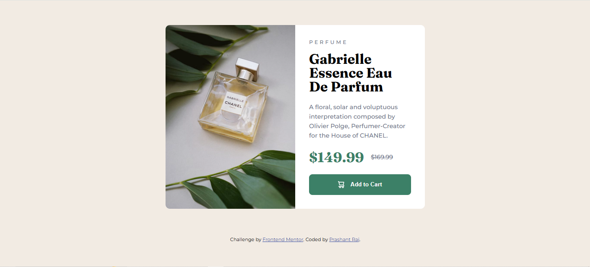

# Frontend Mentor - Product preview card component solution

This is a solution to the [Product preview card component challenge on Frontend Mentor](https://www.frontendmentor.io/challenges/product-preview-card-component-GO7UmttRfa). Frontend Mentor challenges help you improve your coding skills by building realistic projects.

## Table of contents

- [Overview](#overview)
  - [The challenge](#the-challenge)
  - [Screenshot](#screenshot)
  - [Links](#links)
- [My process](#my-process)
  - [Built with](#built-with)
  - [What I learned](#what-i-learned)
  - [Continued development](#continued-development)
  - [Useful resources](#useful-resources)
- [Author](#author)
- [Acknowledgments](#acknowledgments)

## Overview

### The challenge

Users should be able to:

- View the optimal layout depending on their device's screen size
- See hover and focus states for interactive elements

### Screenshot



### Links

- Solution URL: [Add solution URL here](https://github.com/prashantrajch/front-end-mentor/tree/main/product-preview-card-component)
- Live Site URL: [Add live site URL here](https://teal-pasca-619d26.netlify.app/)

## My process

### Built with

- Semantic HTML5 markup
- CSS custom properties
- Flexbox
- Mobile-first workflow
- Google Fonts (Fraunces, Montserrat)

### What I learned

This project helped me improve my skills in responsive design and layout composition using **Flexbox**. I also got more familiar with using **CSS custom properties (variables)** for color and spacing consistency.

I practiced using `background-image` in CSS for responsive layouts, and I improved my understanding of how to structure components semantically.

```html
<!-- HTML structure for product info -->
<section class="product-info">
  <header class="product-header">
    <span class="product-category">Perfume</span>
    <h1 class="product-title">Gabrielle Essence Eau De Parfum</h1>
  </header>
  ...
</section>

/* CSS for responsive layout */
@media screen and (max-width: 375px) {
  .card {
    flex-direction: column;
  }
  .product-image {
    background-image: url("./images/image-product-mobile.jpg");
  }
}
```

Continued development
In future projects, I would like to:

Explore using CSS Grid for similar layouts.

Add JavaScript interactivity, such as updating a cart count.

Improve accessibility (focus states, alt attributes, ARIA roles).

Practice converting this static card into a React component.

Useful resources
MDN Web Docs - For HTML and CSS references.

CSS Tricks Flexbox Guide - Helped reinforce Flexbox layout structure.

Google Fonts - For importing and using custom fonts.

Author
Website - Prashant Raj

Frontend Mentor - @prashantrajch

GitHub - @prashantrajch

Acknowledgments
Thanks to Frontend Mentor for providing these challenges to help developers improve their frontend skills with real-world designs.
