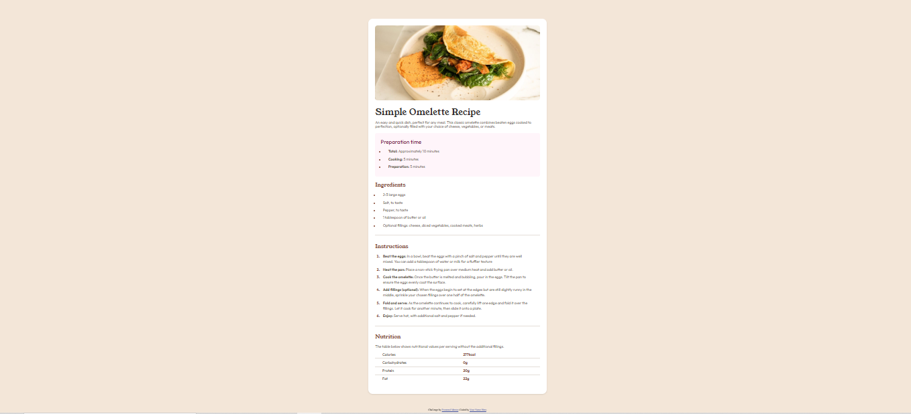

# Frontend Mentor - Recipe page solution

This is a solution to the [Recipe page challenge on Frontend Mentor](https://www.frontendmentor.io/challenges/recipe-page-KiTsR8QQKm). Frontend Mentor challenges help you improve your coding skills by building realistic projects.

## Table of contents

- [Overview](#overview)
  - [Screenshot](#screenshot)
  - [Links](#links)
- [My process](#my-process)
  - [Built with](#built-with)
  - [What I learned](#what-i-learned)
  - [Continued development](#continued-development)
  - [Useful resources](#useful-resources)
- [Author](#author)
- [Acknowledgments](#acknowledgments)

## Overview

A clean and responsive **recipe page for a simple omelette**, designed using semantic HTML and styled with modern CSS features such as custom properties and flexbox. The project emphasizes structured content layout and visually clear sections for preparation time, ingredients, instructions, and nutrition.

### Screenshot



> 📸 Tip: Replace the screenshot above with an actual image of your rendered page.

### Links

- Solution URL: [Add solution URL here](https://github.com/prashantrajch/front-end-mentor/tree/main/recipe-page)
- Live Site URL: [Add live site URL here](https://adorable-griffin-1eb014.netlify.app/)

## My process

### Built with

- Semantic HTML5
- CSS custom properties (variables)
- Flexbox
- Mobile-first responsive design
- Vanilla HTML/CSS (no frameworks)

### What I learned

This project helped me reinforce key frontend skills:

- **Structuring semantic content** for better accessibility and SEO.
- **Using CSS variables** for theme consistency and maintainability.
- **Designing mobile-first** layouts and adapting them with media queries.
- Implementing **clean visual hierarchy** using spacing, color, and typography.

```html
<section class="instructions-section">
  <h3 class="instructions-title">Instructions</h3>
  <ol class="instructions-list">
    <li><strong>Beat the eggs:</strong> <span>In a bowl, ...</span></li>
  </ol>
</section>
css
Copy
Edit
:root {
  --color-Stone-100: hsl(30, 54%, 90%);
  --color-Rose-800: hsl(332, 51%, 32%);
}
```

Continued development
In future projects, I aim to explore:

Using CSS Grid more effectively for complex layouts.

Improving accessibility (a11y) by adding ARIA roles and keyboard navigation.

Incorporating animations and transitions for enhanced user experience.

Useful resources
CSS Variables (MDN) – Helped me understand scoped variables.

Flexbox Guide (CSS Tricks) – A go-to resource for layout structuring.

Frontend Mentor Community – Great for feedback and solution comparisons.

Author
Frontend Mentor – @prashantrajch

Twitter – @prashantrajch

Acknowledgments
Thanks to the Frontend Mentor team for creating helpful real-world challenges. Special appreciation to the community for their helpful feedback and guidance.

---

### ✅ Next Steps:

1. **Update the following placeholders:**
   - `[@prashantrajch]`, `https://your-live-site-url.com`, and screenshot paths.
2. **Add the actual screenshot image** as `screenshot.png` in the root or `assets` directory.
3. **Deploy your site (optional)** on platforms like GitHub Pages, Netlify, or Vercel, then link it.

---

N