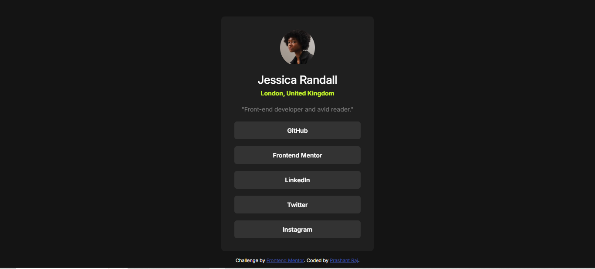

# Frontend Mentor - Social links profile solution

This is a solution to the [Social links profile challenge on Frontend Mentor](https://www.frontendmentor.io/challenges/social-links-profile-UG32l9m6dQ). Frontend Mentor challenges help you improve your coding skills by building realistic projects. 

## Table of contents

- [Overview](#overview)
  - [The challenge](#the-challenge)
  - [Screenshot](#screenshot)
  - [Links](#links)
- [My process](#my-process)
  - [Built with](#built-with)
  - [What I learned](#what-i-learned)
  - [Continued development](#continued-development)
  - [Useful resources](#useful-resources)
- [Author](#author)
- [Acknowledgments](#acknowledgments)

## Overview

### The challenge

Users should be able to:

- See hover and focus states for all interactive elements on the page

### Screenshot



> **Note**: Replace the above screenshot path with an actual screenshot image in your project folder.

### Links

- **Solution URL:** [GitHub Repo](https://github.com/prashantrajch/front-end-mentor/tree/main/social-links-profile-main)
- **Live Site URL:** [Live Demo on Netlify](https://jade-pudding-dfee08.netlify.app/)

## My process

### Built with

- Semantic HTML5 markup
- CSS custom properties
- Flexbox
- Mobile-first workflow
- Vanilla HTML & CSS

### What I learned

This project reinforced my understanding of:

- Centering elements using Flexbox.
- Creating clean and responsive card components.
- Styling buttons with hover effects using custom properties.

Example of the button hover effect:

```css
.social-list .social-link:hover,
.social-list .social-link:active {
  background-color: var(--color-green);
  color: black;
}
```

Continued development
In future projects, I’d like to:

Explore using a CSS preprocessor like SCSS for larger styling needs.

Add animations or transitions for more interactive UI elements.

Practice building more complex layouts with CSS Grid.

Useful resources
Frontend Mentor Documentation - Great for understanding expectations and best practices.

MDN Web Docs - My go-to reference for HTML and CSS syntax.

CSS Tricks - Flexbox Guide - Helped me quickly set up the layout.

Author
Frontend Mentor - @prashantrajch

GitHub - prashantrajch

Acknowledgments
Thanks to Frontend Mentor for providing such high-quality and realistic challenges to practice modern front-end development skills.

---

### ✅ Next Steps:
- Replace `screenshot.jpg` with an actual screenshot of your site.
- Add your Netlify link and GitHub repo (already included).
- Customize anything further if you'd like — I kept it professional but simple.

Let me know if you'd like a version with badges, tech stack icons, or a fancier layout!